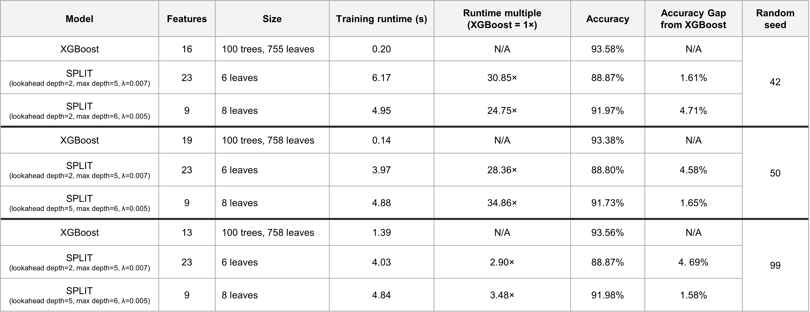

# DIMEX
Dimex is a library I created for all the utilities related to the Rutgers MBS Summer 2025 DIMACS externship.

An externship is a project facilitated by the Rutgers University MBS program, in which students inside a company under an academic capacity.

In this project, I worked with DIMACS — Rutgers' Center for Discrete Mathematics and Theoretical Computer Science. Our aim was to demonstrate whether interpretable Machine Learning models are able to reach a satisfying level of performance relative to black box models when ran on tabular data. The performance of the interpretable algorithm SPLIT ([paper](https://arxiv.org/abs/2502.15988), [repository](https://github.com/VarunBabbar/SPLIT-ICML/)) was benchmarked against that of XGBoost.

## Features & Workflow
- **Preprocessing**: Missing-value cleaning, label binarization, categorical encoding, SMOTE, and undersampling
- **XGBoost toolkit**: Training, model metadata, feature selection, and predictions
- **SPLIT toolkit**: Training, model metadata, and predictions

1. Preprocess the data
2. SPLIT first iterations and fine-tuning
3. Feature selection with XGBoost
4. Final SPLIT iteration
5. Model comparison

## Project Structure
```
├── airline-passenger-satisfaction/ # Dataset used
├── dimex/
├── notebooks/ # Notebooks running dimex with different seed values
├── results/ # Comparison table of the different results from running XGBoost and SPLIT using different parameters and seed values
├── environment.yml # Conda environment file (instead of requirements.txt)
├── .gitignore
├── LICENSE
├── README.md
├── SETUP.md # Setup guide
└── setup.py # Run this to install dimex
```

## Installation
See [SETUP.md](SETUP.md) for full installation instructions.

## Usage
```python
import dimex as dx

# Clean, encode, and binarize the data
dataset_clean, dataset_missing_stats, dataset_clean_filename = dx.clean_missing('your_data.csv')
dataset_encoded, dataset_encoded_filename = dx.binarize_encode(dataset_clean_filename, 'non-binarized class 1', 'non-binarized class 2')

# Split between train and test
x_train, x_test, y_train, y_test = dx.split_dataset(dataset_encoded, test_size=0.7, random_state=42)

# Train models
xgb_model, xgb_size, runtime = dx.train_xgb(x_train, y_train)
split_model, tree, meta = dx.train_split(x_train, y_train, 2, 5, 0.01)

# Evaluate
xgb_pred, xgb_acc = dx.prediction_xgb(xgb_model, x_test, y_test)
dx.cm(y_test, xgb_pred)
split_pred = dx.prediction_split(split_model, x_test, y_test)
dx.cm(y_test, split_pred[0], cmap='Purples')
```

Refer to the notebooks for a more detailed guide.

## Results
Representative outcomes (3 random seeds) comparing SPLIT against XGBoost on the Airline Passenger Satisfaction dataset:



## References
Babbar, V., McTavish, H., Rudin, C., Seltzer, M. (2025). Near-Optimal Decision Trees in a SPLIT Second. arXiv preprint arXiv:2502.15988